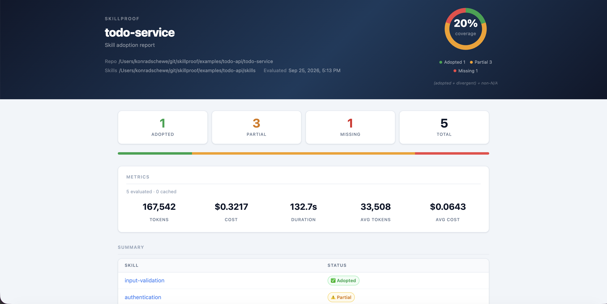
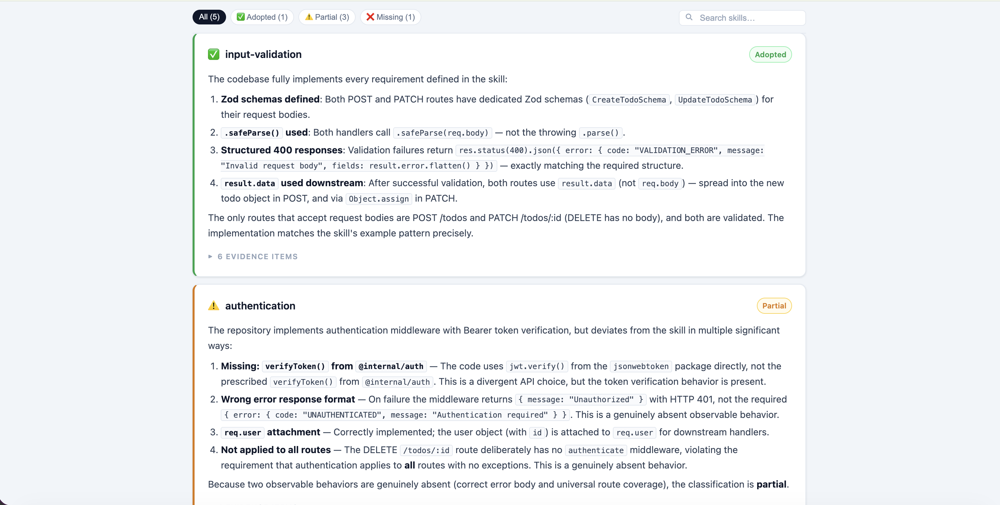

# skillproof-action

**Prove that your codebase adopts the skills — directly in CI.**

GitHub Action for [skillproof](https://github.com/konradschewe/skillproof). Evaluates `SKILL.md` files against your codebase on every push, on a schedule, or on demand. Results appear in the Actions step summary and can be published to GitHub Pages.

---





---

## Quick start

### Anthropic

```yaml
- uses: actions/checkout@v4

- uses: konradschewe/skillproof-action@v1
  with:
    skills-dir: ./skills
    anthropic-api-key: ${{ secrets.ANTHROPIC_API_KEY }}
```

Results are automatically written to the Actions step summary.

### SAP AI Core

```yaml
- uses: actions/checkout@v4

- uses: konradschewe/skillproof-action@v1
  with:
    skills-dir: ./skills
    provider: aicore
    aicore-service-key: ${{ secrets.AICORE_SERVICE_KEY }}
    # aicore-resource-group: default   # optional, defaults to "default"
```

`AICORE_SERVICE_KEY` must be the full service key JSON from BTP, containing `clientid`, `clientsecret`, `url`, and `tokenurl`. Store it as a repository or organization secret.

---

## Common workflows

### Fail the build on missing or partial skills

```yaml
- uses: konradschewe/skillproof-action@v1
  with:
    skills-dir: ./skills
    anthropic-api-key: ${{ secrets.ANTHROPIC_API_KEY }}
    fail-on: missing,partial
```

### Track adoption over time — weekly report on GitHub Pages

Run on a schedule and publish a standalone HTML report. Useful for platform teams monitoring skill adoption across a consumer repository.

```yaml
name: Skillproof

on:
  schedule:
    - cron: "0 6 * * 1"  # every Monday at 6am
  workflow_dispatch:

permissions:
  contents: write

jobs:
  skillproof:
    runs-on: ubuntu-latest
    steps:
      - uses: actions/checkout@v4

      - uses: konradschewe/skillproof-action@v1
        with:
          skills-dir: ./skills
          anthropic-api-key: ${{ secrets.ANTHROPIC_API_KEY }}
          concurrency: '5'
          publish-pages: true
```

The report is published to `https://<owner>.github.io/<repo>/skillproof/`.

> **Note:** GitHub Pages must be enabled: Settings → Pages → Source: Deploy from branch → `gh-pages`.

### Evaluate a single skill

```yaml
- uses: konradschewe/skillproof-action@v1
  with:
    skills-dir: ./skills
    anthropic-api-key: ${{ secrets.ANTHROPIC_API_KEY }}
    filter: authentication
```

---

## Inputs

| Input | Required | Default | Description |
|---|---|---|---|
| `skills-dir` | **yes** | — | Path to the directory containing `SKILL.md` files, searched recursively. |
| `provider` | no | `anthropic` | LLM provider: `anthropic` or `aicore`. |
| `anthropic-api-key` | no | — | Anthropic API key. Required when `provider` is `anthropic`. |
| `aicore-service-key` | no | — | SAP AI Core service key JSON from BTP (contains `clientid`, `clientsecret`, `url`, `tokenurl`). Required when `provider` is `aicore`. |
| `aicore-resource-group` | no | `default` | AI Core resource group (namespace where your model deployments live). |
| `filter` | no | — | Only evaluate skills whose name contains this substring. |
| `system-prompt` | no | — | Additional context appended to the evaluator's system prompt. Use to describe the nature of the repository (e.g. "this is a shared library, not a concrete agent"). |
| `strict` | no | `false` | Require exact APIs and patterns as specified in each skill. Without `strict`, functionally equivalent implementations are accepted. |
| `concurrency` | no | `1` | Number of skills to evaluate in parallel. |
| `fail-on` | no | — | Exit with code `1` if any skill matches one of the given statuses. Comma-separated: `missing`, `partial`, `divergent`. |
| `output-format` | no | `github-summary` | Output format: `markdown`, `github-summary`, `json`, or `html`. |
| `output-file` | no | — | Write the report to this file path (relative to `GITHUB_WORKSPACE`). |
| `publish-pages` | no | `false` | Publish an HTML report to GitHub Pages. Requires `contents: write` permission and Pages enabled on the `gh-pages` branch. Forces `output-format: html`. |
| `pages-destination-dir` | no | `skillproof` | Subdirectory on GitHub Pages to publish to. |
| `cache-dir` | no | `.skillproof-cache` | Directory for the evaluation cache. Persisted across runs via `actions/cache`. |

---

## Outputs

| Output | Description |
|---|---|
| `report-path` | Path to the generated report file. Set when `output-file` is given, or when `publish-pages` is `true`. |

---

## Provider details

### Anthropic

Pass `anthropic-api-key`. Models used:
- Evaluator: `claude-sonnet`
- Explorer: `claude-haiku`

### SAP AI Core

Pass `aicore-service-key` (the full BTP service key JSON). `aicore-resource-group` is optional — omit it to use `"default"`.

Model deployments required in your AI Core instance:
- Evaluator: `anthropic--claude-4.6-sonnet`
- Explorer: `anthropic--claude-4.5-haiku`

---

See the [skillproof documentation](https://github.com/konradschewe/skillproof) for a full explanation of how evaluation works, skill authoring, adoption statuses, and output formats.
